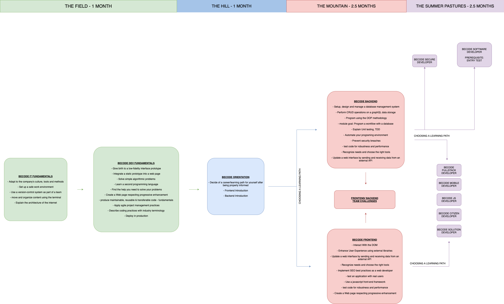

# Swartz 7 

This repo is your go-to place for all information on your activities at BeCode: briefings, tutorials, etc.  
Clone it on your computer and `git pull` regularly in order to fetch the latest updates made by your coaches.

## ➡️ What's coming

### 🌱 The field

- HTML: usage & semantics
- CSS: styling, preprocessors and frameworks
- Git: working in development teams
- IDE & terminal: your tools of trade

### 🏕️ The hill

- Programming concepts & logic
- JavaScript (JS): adding interactivity and connecting to external services

### ⛰️ The mountain

- PHP: object orientated programming, best practises and frameworks
- JS: frameworks
- Servers & hosting

### 🚠 Summer pastures

- Diving deeper in your technology of interest
- Bigger projects
- Sharing knowledge
- Preparing for internship

## ✨ How to thrive at BeCode?

Read the following documents:

Read the **Pedagogical Contract** in 
   - [English](https://github.com/becodeorg/BeCode/blob/master/educationalcontract.md)
   - [French](https://github.com/becodeorg/BeCode/blob/master/contratpedagogique.md)
   - [Dutch](https://github.com/becodeorg/BeCode/blob/master/pedagogischcontract.md)

Your contacts at BeCode:

1. Your lead coach: Mike - mickael@becode.org
2. Secondary coach: Dante - dante.solis@becode.org 
3. Your professional insertion referent: Sophia - sophia@becode.org 

## 🕑 Respect for planning: being late & absence

In case of **delay**, **absence** or **early leave** (planned or not), you will need to warn us.

In short here is what you do in any of the three cases above:

1. Send a message to _all_ your coach(es) by mail (and perhaps Discord too)
2. Warn BeCode through [my.becode.org](https://my.becode.org/):
   - If you already have some note to justify your absence (eg. a doctor's note), then send this straight to us using the platform (my.becode.org);
   - If you know that you are going to obtain such document, tell us when you notify us of your absence. Once you have the document, send it to us through the platform;
   - When you know that you will have no legal reason for the absence or delay then please let us know <abbr title="As Soon As Possible">ASAP</abbr> as well on Discord. Not showing up or showing up late is considered unprofessional.

**[Reminder](https://github.com/becodeorg/BeCode/blob/master/educationalcontract.md#sanctions)**:

- 2 unjustified occasions of being late or leaving early is seen as an absence
- 2 unjustified absences leads to a one-on-one conversation
- 6 unjustified absences leads to a termination of your contract with us {and the vdab} and results in you leaving this training permanently.
- If the absence rate (justified or not) exceeds 20%, BeCode may decide on the final exclusion of the learner.

## 📅 Agenda

To keep up to date with the upcoming events, workshops and hackathons remember to check the **BeCode Global Discord server #events channel**!

## 🌴 Vacation and holidays

- 27/02/23 - 03/03/23
- 02/04/23 - 07/04/23

## 👩‍🎓 Briefings

Here is a chronological list of projects, in the order they were tackled by your startup.

1. [The Field](./1.The-Field)
2. [The Hill](./2.The-Hill)
3. [The Mountain](./3.The-Mountain) 
4. [Summer-Pastures](./4.Summer-Pastures) 

And remember, we NEVER give up! ;)
